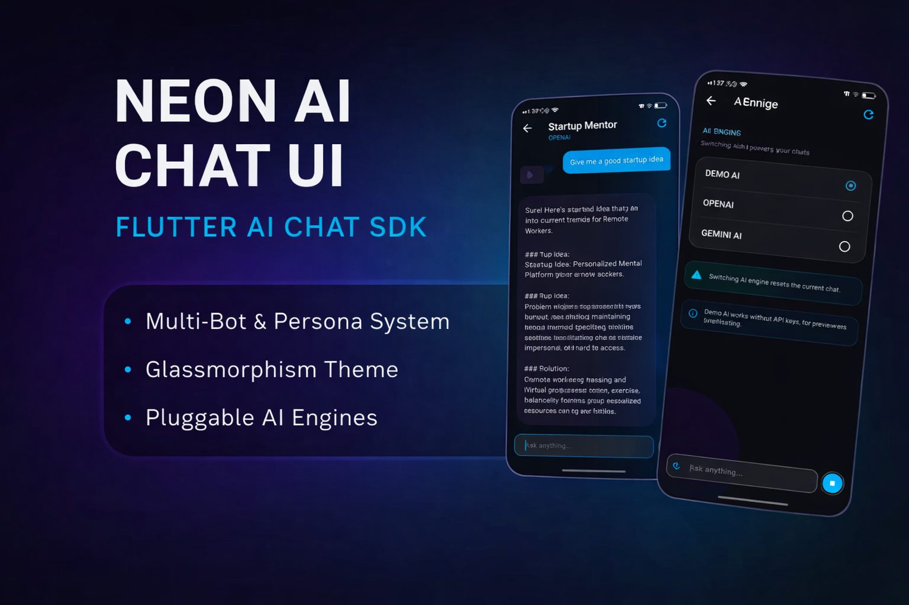
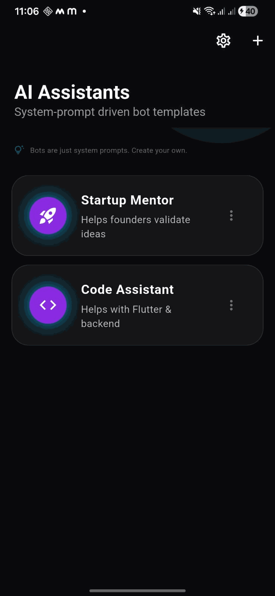

<p align="center">
  
</p>

[](https://fixitdev.gumroad.com/l/neon-ai-chat-ui)


# Neon AI Chat UI Kit — Flutter Demo

**This is a live demo app for the commercial Neon AI Chat UI Kit.**

This demo shows only static UI and screenshots — it does *not* include the real production code.

👉 Buy the full UI kit here:  
https://fixitdev.gumroad.com/l/neon-ai-chat-ui

---

## What’s Included

This standalone demo includes:

✅ Welcome screen with BUY link  
✅ Screenshot slides of key UI screens  
✅ Mock navigation and visual flow  
✅ Example assets  
❌ No real AI logic  
❌ No engine switching  
❌ No chat controllers
❌ No Riverpod providers

The goal is to help you preview the UI before buying.

---

## Screenshots

Use left/right taps in the demo to browse screenshots.

The slides include:
- Bot list screen
- Bot switching
- Bot management
- Create bot
- Chat UI (loading + streamed replies)

## Preview Demo

<p align="center">
  
</p>

---

## How to Run

1. Clone this repo:

```bash
git clone https://github.com/Fix-It-Dev/Neon-Ai-Cha-UI-Kit-Demo.git
```
Change directory:

```bash
cd Neon-Ai-Cha-UI-Kit-Demo
```

Get dependencies:

```bash
flutter pub get
```

Run app:

```bash
flutter run
```

Get the Full UI Kit
This demo only previews the UI.

To build real AI chat apps using OpenAI, Gemini, or any custom engine, purchase the full UI Kit:

👉 https://fixitdev.gumroad.com/l/neon-ai-chat-ui

Includes:

  1. Real widgets

  2. AI engine wiring

  3. Bot controllers

  4. Riverpod architecture

  5. Commercial license

  6. Documentation


Demo License

Use this template for preview and learning only.
See LICENSE-DEMO.txt for details.
